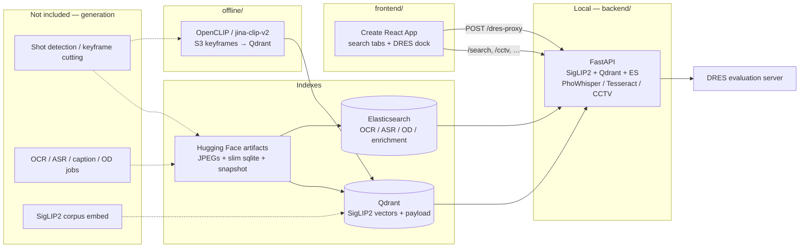

# Mentos

Interactive **video event retrieval** for [AI Challenge HCMC 2026](https://aichallenge.hochiminhcity.gov.vn/) — search a large news / CCTV / cycling corpus with natural language (including Vietnamese), then jump to the matching shot and submit it to the contest evaluation server.

**AIC 2026 Finalist out of 811 teams.**

This public monorepo is a cleaned, secret-scanned export of the Mentos stack: FastAPI retrieval API, React operator UI, and the `offline/` S3 → OpenCLIP / Jina CLIP → Qdrant indexer. Shot detection, keyframe cutting, and the corpus OCR / ASR / caption / object-detection **generation** jobs are **not included**. Serving copies those tables from a Hugging Face sqlite dump and restores a SigLIP2 Qdrant snapshot. Field names, ES/Qdrant schemas, and how to run the indexer: [docs/offline-pipeline.md](docs/offline-pipeline.md).

---

## Screenshots

UI captured locally with **no live backend** (empty search / CCTV results). The app opens on visual search — there is no login gate.

| Visual search | CCTV tab |
|---|---|
| [](docs/assets/02-visual-search.png) | [](docs/assets/03-cctv.png) |

---

## Architecture

The serving stack consumes a Hugging Face dataset (JPEG tars, slim sqlite, a SigLIP2 Qdrant snapshot) and builds Elasticsearch indexes from copied enrichment tables. The React UI queries FastAPI and submits shots to DRES through a backend proxy.



Details: [docs/architecture.md](docs/architecture.md). Offline stages, field names, and ES/Qdrant schemas: [docs/offline-pipeline.md](docs/offline-pipeline.md).

---

## Features

| Feature | Where |
|---------|--------|
| Text-to-keyframe search (`normal`) | `POST /search` + SigLIP2 + Qdrant |
| Hybrid visual + enrichment FTS | `search_method=hybrid` |
| Temporal multi-event search | LLM split, then sequential visual search |
| Hierarchical / group-scoped search | `hierarchical` (`hierachical` alias) |
| OCR / ASR / OD filter search | `/ocr-search`, `/asr-search`, `/filter-search` |
| Serve keyframes | `GET /frames/{video_id}/{frame}.jpg` |
| Contest clip transcription | PhoWhisper (`POST /asr-transcribe`) — live upload, not corpus ASR |
| Contest screenshot OCR | Tesseract vie+eng (`POST /ocr-image`) — live upload, not corpus OCR |
| CCTV clock → frame | `/cctv/*` (needs a `cams.json` not in git) |
| DRES CORS proxy | `POST /dres-proxy` |
| Operator UI | React tabs: visual, ASR, OD, OCR, CCTV, screenshot OCR, voice; DRES submit bar |
| Offline embed + upsert | [`offline/run_indexing.py`](offline/run_indexing.py) — S3 keyframes → OpenCLIP / Jina CLIP → Qdrant |

No latency or rank numbers are claimed here. The serving encoder is **SigLIP2**. The `offline/` indexer uses **OpenCLIP / Jina CLIP v2** (a different collection).

---

## Tech stack

- **API:** Python, FastAPI, Uvicorn, Pydantic v2
- **Query encoder:** `google/siglip2-so400m-patch14-384` (Hugging Face Transformers / PyTorch)
- **Vectors (serve):** Qdrant (default collection `siglip2_keyframes_final`)
- **Vectors (offline indexer):** OpenCLIP `ViT-L-14` / `jinaai/jina-clip-v2` → Qdrant
- **Text indexes:** Elasticsearch 8.15 (OCR / ASR / OD / enrichment)
- **Media catalog:** `backend/urls.csv` (1,487 videos); optional Bunny Stream
- **Contest helpers:** `vinai/PhoWhisper-*`, Tesseract `vie+eng`
- **LLM (optional):** OpenAI-compatible API for translate / temporal split
- **UI:** React 18, Create React App (`react-scripts` 5)

---

## Repository structure

```
.
├── README.md
├── LICENSE                 # not yet specified
├── .env.example            # pointers to per-package examples
├── backend/                # FastAPI app
│   ├── api.py
│   ├── run.py
│   ├── core/
│   ├── schema/
│   ├── scripts/            # HF extract + ES index (not corpus generation)
│   ├── docker-compose.yml  # local Qdrant + Elasticsearch
│   ├── test_cases/
│   └── .env.example
├── frontend/               # cleaned CRA app
│   ├── src/
│   ├── .env.example
│   └── README.md
├── offline/                # S3 → OpenCLIP / Jina → Qdrant
│   ├── run_indexing.py
│   ├── aic_indexing/
│   └── README.md
└── docs/
    ├── architecture.md
    ├── offline-pipeline.md
    └── assets/             # UI screenshots
```

---

## Quick start (local only)

You need Python 3.10+, Node.js 14+, and Docker (for Qdrant + Elasticsearch). Nothing here is a public deploy.

### 1. Local Qdrant and Elasticsearch

```bash
cd backend
docker compose up -d
```

This publishes Qdrant on `localhost:6333` and Elasticsearch on `localhost:9200`. Alternatively: `docker run -p 6333:6333 -p 6334:6334 qdrant/qdrant:v1.13.2` and start ES yourself (`scripts/run_elasticsearch.sh`, or let the API try `START_ELASTICSEARCH=true`).

If Compose is already serving Elasticsearch, set `START_ELASTICSEARCH=false` in `backend/.env`.

### 2. Backend

```bash
cd backend
python -m venv .venv && source .venv/bin/activate
pip install -r requirements.txt
cp .env.example .env
# fill empty secret names only (HF_TOKEN if you want the dataset; OPENAI_API_KEY for translate/temporal)
python run.py
```

API: `http://localhost:8000` (docs at `/docs`). First start may download keyframes and a Qdrant snapshot (`HF_TOKEN`, several GiB). Skip with `PREPARE_LOCAL_DATA=false` / `PREPARE_ELASTICSEARCH=false`.

Details: [backend/README.md](backend/README.md).

### 3. Frontend

```bash
cd frontend
cp .env.example .env
# optional: REACT_APP_API_URL=http://localhost:8000
# or leave empty to use the CRA proxy (BACKEND_URL, default http://localhost:8000)
npm install
npm start
```

Open `http://localhost:3000`. The search UI loads immediately. Full env list: [frontend/README.md](frontend/README.md).

### 4. Offline indexer (optional)

S3 keyframes must already exist. This does not cut video or run OCR/ASR. Schema and gaps: [docs/offline-pipeline.md](docs/offline-pipeline.md). Commands: [offline/README.md](offline/README.md).

```bash
cd offline
python -m venv .venv && source .venv/bin/activate
pip install -r requirements.txt   # install torch for your CUDA/CPU first; see offline/README.md
cp .env.example .env              # AWS + Qdrant — empty names only
python run_indexing.py --s3-uri s3://YOUR_BUCKET/YOUR_PREFIX/
```

---

## Environment variables

Secrets belong in local `.env` files only. Never commit real values. The committed examples use **empty names** for tokens/keys and localhost-only defaults for local ports.

| Variable | Package | Purpose |
|----------|---------|---------|
| `HF_TOKEN` / `HF_TOKEN_WRITE` | backend | Download HF keyframes, sqlite, Qdrant snapshot |
| `HF_REPO_ID` | backend | Dataset repo (default `htNghiaaa/aic26-lowres-keyframes`) |
| `QDRANT_URL` / `QDRANT_API_KEY` / `QDRANT_COLLECTION` | backend | Vector store |
| `OPENAI_API_KEY` or `OPEN_AI_API_KEY` | backend | Translate / temporal split |
| `GROQ_API_KEY` | backend | Still loaded in settings; current query client is OpenAI |
| `ELASTICSEARCH_URL` and `ELASTICSEARCH_*_INDEX` | backend | OCR / ASR / OD / enrichment |
| `AWS_ACCESS_KEY_ID` / `AWS_SECRET_ACCESS_KEY` | backend, offline | S3 (offline indexer; optional backend if `KEYFRAME_SOURCE` is not `hf`) |
| `S3_URI` / `S3_BUCKET_NAME` / `S3_PREFIX` | offline | Keyframe object prefix |
| `BUNNY_LIBRARY_ID` / `BUNNY_API_KEY` / `BUNNY_CDN_HOST` | backend | Hosted video playback |
| `ASR_WHISPER_MODEL` | backend | PhoWhisper size or hub id (live `/asr-transcribe` only) |
| `CCTV_CAMS_PATH` | backend | CCTV clock index JSON |
| `CORS_ORIGINS` / `PUBLIC_BASE_URL` / `HOST` / `PORT` | backend | Local HTTP |
| `REACT_APP_API_URL` / `REACT_APP_BACKEND_ORIGIN` | frontend | Browser → API origin |
| `REACT_APP_DRES_URL` | frontend | Default DRES URL in the submit bar |
| `BACKEND_URL` | frontend (dev) | CRA proxy target |

Full names and defaults:

- [`.env.example`](.env.example) (pointers)
- [`backend/.env.example`](backend/.env.example)
- [`frontend/.env.example`](frontend/.env.example)
- [`offline/.env.example`](offline/.env.example)

---

## Credits

- **Đinh Thiên Ân** ([@dinhthienan33](https://github.com/dinhthienan33)) — backend history, frontend `siteInfo` author.
- Frontend cleaned from `AIC2025_Mentos_frontend` `main` @ `fe52014`.
- Serving backend sanitized from the `aic2026` line of `AIC2025_Mentos-v2`.
- Offline indexer cleaned from `AIC2026-top5` `main` @ `0e2cd1c`.

No other human commit authors appear on the exported histories we copied.

---

## License

**Not yet specified.** See [LICENSE](LICENSE).
