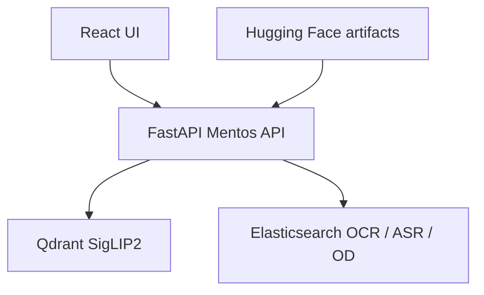

# Mentos

Interactive **video event retrieval** for [AI Challenge HCMC 2026](https://aichallenge.vn/) — search a large news / CCTV / cycling corpus with natural language (including Vietnamese), then jump to the matching shot.

**AIC 2026 Finalist · 811 teams**

| | |
|---|---|
| **Live UI** | [aic2025-mentos-frontend.vercel.app](https://aic2025-mentos-frontend.vercel.app) (login gated; source repo was not available when this tree was assembled) |
| **This repo** | Clean monorepo: FastAPI backend + docs. No git history from the old private repos. |
| **Backend origin** | `aic2026` branch of `AIC2025_Mentos-v2` (newest complete line, 2026-09-26) |


---

## What it does

Contest queries ask for a precise moment in thousands of videos. Mentos:

1. Embeds the query with **SigLIP2** and retrieves keyframes from **Qdrant** (optional local GPU index).
2. Optionally translates or splits multi-event queries with an LLM.
3. Filters or boosts with **OCR / ASR / object-entity** text in **Elasticsearch**.
4. Returns ranked keyframes with timestamps and video URLs (`urls.csv`: **1,487** videos).

The public demo UI (Create React App on Vercel) adds search tabs, a DRES submit bar, a voice tab, and CCTV playback. That source is **not** in this repository — see [frontend/README.md](frontend/README.md).

---

## Architecture



Full diagram and API map: [docs/architecture.md](docs/architecture.md).

---

## Features (implemented in the backend we shipped)

| Feature | Where |
|---------|--------|
| Text-to-keyframe search (`normal`) | `POST /search` + SigLIP2 + Qdrant |
| Hybrid visual + enrichment FTS | `search_method=hybrid` |
| Temporal multi-event search | LLM split, then sequential visual search |
| Hierarchical / group-scoped search | `hierarchical` (`hierachical` alias) |
| OCR / ASR / OD filter search | `/ocr-search`, `/asr-search`, `/filter-search` |
| Serve keyframes | `GET /frames/{video_id}/{frame}.jpg` |
| Contest clip transcription | PhoWhisper (`POST /asr-transcribe`) |
| Contest screenshot OCR | Tesseract vie+eng (`POST /ocr-image`) |
| CCTV clock → frame | `/cctv/*` (needs a `cams.json` not in git) |
| DRES CORS proxy | `POST /dres-proxy` |
| Optional Bunny playback URLs | `bunny_client.py` |

No latency numbers are claimed here. Older notes on a sibling branch described a different FAISS/Mongo stack.

---

## Tech stack

- **API:** Python, FastAPI, Uvicorn, Pydantic v2
- **Vectors:** Qdrant, `google/siglip2-so400m-patch14-384` (Hugging Face Transformers / PyTorch)
- **Text indexes:** Elasticsearch 8.15
- **Media catalog:** `urls.csv`; optional Bunny Stream
- **LLM:** OpenAI-compatible API (optional Groq key still listed in settings)
- **Deploy helpers:** Docker Compose, Caddy
- **Frontend (deploy only):** Create React App on Vercel

---

## Repository structure

```
.
├── README.md
├── LICENSE                 # not yet specified
├── .env.example
├── backend/                # FastAPI app (from aic2026)
│   ├── api.py
│   ├── run.py
│   ├── core/
│   ├── schema/
│   ├── scripts/            # HF extract + ES index (not full offline ingest)
│   ├── test_cases/         # Excel sources + eval builders
│   └── .env.example
├── frontend/               # placeholder — GitHub source inaccessible
└── docs/
    ├── architecture.md
    ├── offline-pipeline.md
    └── assets/
```

---

## Setup

### Backend

```bash
cd backend
python -m venv .venv && source .venv/bin/activate
pip install -r requirements.txt
cp .env.example .env
docker run -p 6333:6333 -p 6334:6334 qdrant/qdrant:v1.13.2
python run.py
```

Details: [backend/README.md](backend/README.md). First start may download keyframes and a Qdrant snapshot (`HF_TOKEN`, several GiB).

### Frontend

Source is missing. Point a local checkout of `AIC2025_Mentos_frontend` at this API with:

```bash
REACT_APP_API_URL=http://localhost:8000
REACT_APP_BACKEND_ORIGIN=http://localhost:8000
```

---

## Environment variables

Secrets belong in `backend/.env` / `frontend/.env` only. Placeholders:

| Variable | Used for |
|----------|----------|
| `HF_TOKEN` / `HF_TOKEN_WRITE` | Download HF keyframes, sqlite, Qdrant snapshot |
| `HF_REPO_ID` | Dataset repo (default `htNghiaaa/aic26-lowres-keyframes`) |
| `QDRANT_URL` / `QDRANT_API_KEY` / `QDRANT_COLLECTION` | Vector store |
| `OPENAI_API_KEY` or `OPEN_AI_API_KEY` | Translate / temporal split |
| `GROQ_API_KEY` | Still loaded in settings; current query client is OpenAI |
| `ELASTICSEARCH_URL` and `ELASTICSEARCH_*_INDEX` | OCR / ASR / OD / enrichment |
| `AWS_ACCESS_KEY_ID` / `AWS_SECRET_ACCESS_KEY` | Optional S3 if `KEYFRAME_SOURCE` is not `hf` |
| `BUNNY_LIBRARY_ID` / `BUNNY_API_KEY` / `BUNNY_CDN_HOST` | Hosted video playback |
| `ASR_WHISPER_MODEL` | PhoWhisper size or hub id |
| `CCTV_CAMS_PATH` | CCTV clock index JSON |
| `CORS_ORIGINS` / `PUBLIC_BASE_URL` / `HOST` / `PORT` | HTTP |
| `REACT_APP_API_URL` / `REACT_APP_BACKEND_ORIGIN` | Frontend → API |

Full list with defaults: [backend/.env.example](backend/.env.example).

---

## Offline pipeline

**Included here:** download/extract/index scripts only (`backend/scripts/`, `core/prepare_local.py`). They consume a Hugging Face dataset (JPEG tars, slim sqlite, Qdrant snapshot) and build Elasticsearch indexes.

**Not included:** original keyframe cutting, corpus embedding, OCR/ASR/caption jobs. The private repo `AIC2026-top5` was checked and **could not be cloned** (404). See [docs/offline-pipeline.md](docs/offline-pipeline.md).

---

## Team

From git history of the accessible backend: **Đinh Thiên Ân** ([@dinhthienan33](https://github.com/dinhthienan33)). No other human commit authors appear on `main`, `aic2026`, or `hierachical`. Frontend authors could not be listed (repo inaccessible).

---

## License

**Not yet specified.**
