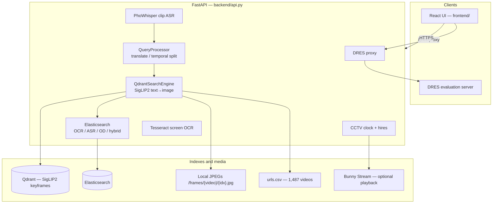

# Architecture

Mentos is an interactive video event-retrieval system built for **AI Challenge HCMC 2026**. This tree is the sanitized **`aic2026` backend**, the cleaned React operator UI (`frontend/`), and the S3 → CLIP → Qdrant indexer (`offline/`). End-to-end flow: [root README](../README.md). Offline gaps: [offline-pipeline.md](./offline-pipeline.md).

## Search modes (`POST /search`)

| `search_method` | Behavior in this codebase |
|-----------------|---------------------------|
| `normal` | Visual only: SigLIP2 query embedding → Qdrant (or local GPU index if `USE_LOCAL_INDEX` files exist). |
| `hybrid` | Visual + enrichment full-text (Elasticsearch `enrichment_keyframes`). |
| `temporal` | LLM splits the query into events, then sequential visual searches. |
| `filtering` | Visual candidates filtered by OCR / ASR / OD constraints. |
| `hierarchical` (`hierachical` alias) | Group-scoped search; legacy `index_files` shard names map to video ids. |

Other HTTP routes: `/filter-search`, `/asr-search`, `/ocr-search`, `/frames/...`, `/catalog`, `/cctv/*`, `/asr-transcribe`, `/ocr-image`, `/dres-proxy`, `/health`, `/models`, `/warmup`. Legacy `model_name` values (`jinav2`, `blip2`, …) alias to SigLIP2.

## Runtime pieces

| Piece | Role |
|-------|------|
| `core/models.py` | Lazy-load `google/siglip2-so400m-patch14-384` (override with `MODEL_ID`). |
| `core/qdrant_search.py` | Vector retrieval; optional `core/local_index.py` exact GPU cosine. |
| `core/query_processing.py` | OpenAI-compatible LLM (`OPENAI_API_KEY` / `OPEN_AI_API_KEY`); Groq key is still read in settings but the active client is OpenAI. |
| `core/es_*.py` | Elasticsearch stores built from slim sqlite. |
| `core/hf_frames.py` | Serve / cache JPEG keyframes from local extract or HF tars. |
| `bunny_client.py` | Optional Bunny Stream catalog for playable URLs. |
| `urls.csv` | **1,487** rows: `video_name`, YouTube `url`, `fps`. |
| Caddy + Docker Compose | Reverse proxy and ES sidecar. Cloudflare tunnel files from the old repo are **not** included. |

## What changed vs the 2025 `main` branch

`main` (2025-09) served FAISS + Azure Blob + MongoDB Atlas + Groq. `aic2026` deleted that path (`core/search2.py`, `azure_client.py`, FAISS bins) and moved to Qdrant + HF + ES. This monorepo follows `aic2026` only.

Offline ingest that **is** in git is the OpenCLIP / Jina CLIP indexer under `offline/` (from `AIC2026-top5`). How the SigLIP2 snapshot and corpus OCR/ASR/OD tables were *created* is **not included in this repo** — see [offline-pipeline.md](./offline-pipeline.md).
