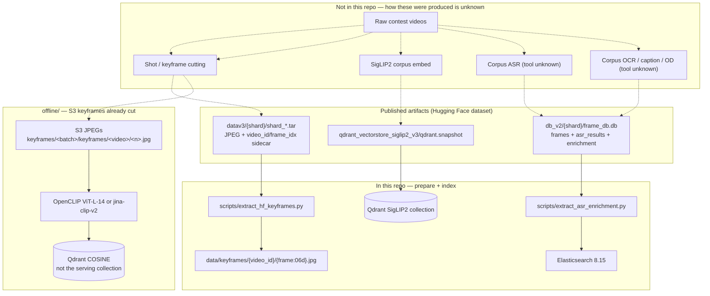

# Offline pipeline

This repo ships the **serving** stack (FastAPI + React), the **`offline/`** S3 → OpenCLIP / Jina CLIP → Qdrant indexer, and the backend scripts that **reshape already-built artifacts** into local files and Elasticsearch. It does **not** include the jobs that cut video, embed the SigLIP2 corpus, or generate corpus OCR / ASR / captions / object entities.

What follows is reconstructed from:

- [`offline/`](../offline/) — cleaned export of `AIC2026-top5` `main` @ `0e2cd1c` (how to run: [`offline/README.md`](../offline/README.md))
- the **backend** indexers and sqlite slimming code

Unknowns are marked. No throughput, VRAM, or corpus-size numbers are claimed.

---

## End-to-end (what the code actually shows)



Serving search uses **SigLIP2** vectors (`QDRANT_COLLECTION`, default `siglip2_keyframes_final`) plus the Elasticsearch indexes below. `offline/` writes a **different** collection (default `keyframes_clip` / optional `keyframes_jinav2_final`) with OpenCLIP or Jina CLIP. Those two vector stores are not interchangeable.

---

## 1. Keyframe extraction

### Cutting (not in this repo)

No shot detector, ffmpeg interval cutter, TransNet, or PySceneDetect job is in the backend or `offline/`. Both paths assumed keyframes **already existed**.

`offline/aic_indexing/metadata.py` requires S3 keys matching:

```text
.../keyframes/<batch_folder>/keyframes/<video_id>/<numeric_frame>.<jpg|jpeg|png|webp|bmp|gif>
```

Example: `keyframes/L21_a/keyframes/L21_V001/123.jpg`

- `L21_a` → payload `batch_id` `L21` (trailing `_<letter>` stripped)
- filename stem must be numeric; that integer is `frame_index`
- `timestamp = round(frame_index / fps, 3)` with default fps **25** (`KEYFRAME_FPS` / `--fps`)
- `frame_id` is `frame_index` zero-padded to 6 digits

**Unknown:** interval vs shot-based cutting, detector, raw resolution, and whether the HF JPEGs are the same files that sat on S3.

### Serving extract (in repo)

`backend/scripts/extract_hf_keyframes.py` downloads Hugging Face tars under `HF_KEYFRAME_PREFIX` (default `datav3`) from `HF_REPO_ID` (default `htNghiaaa/aic26-lowres-keyframes`) and writes:

```text
{KEYFRAME_LOCAL_DIR}/{video_id}/{frame_idx:06d}.jpg
```

Each tar member is a JPEG plus a JSON sidecar with `video_id` and `frame_idx`. This is **unpack**, not cutting. `python run.py` calls it via `core/prepare_local.py` unless `PREPARE_LOCAL_DATA=false`.

`backend/scripts/fill_fps_from_hf.py` copies `frames.fps` from sqlite into `urls.csv`. Default fps in settings is **25** if a row is missing.

---

## 2. Embeddings → Qdrant

### Serving (SigLIP2 snapshot)

Query encoder: `google/siglip2-so400m-patch14-384` (`MODEL_ID` in `core/models.py`).

At startup, `core/snapshot.py` may download **only** a `.snapshot` file (default `qdrant_vectorstore_siglip2_v3/qdrant.snapshot`) and restore it into `QDRANT_COLLECTION`. Hits read payload fields:

| Payload key | Used for |
|-------------|----------|
| `video_id` | result id, keyword filter (payload index created if missing) |
| `frame_idx` | keyframe number / JPEG path |
| `batch` | catalog groups (examples in comments: `L21_a`, `M01`, `N001`, `S01`) |
| `global_id` | join key toward sqlite `frames.global_id` |

There is **no** SigLIP2 embed-to-Qdrant job in this repo. How the snapshot was trained/built is **unknown**.

Optional exact GPU search (`core/local_index.py`) loads `data/local_index/vectors_fp16.npy` if present. Nothing in git writes that file.

### `offline/` indexer (OpenCLIP / Jina)

Code: [`offline/run_indexing.py`](../offline/run_indexing.py) + [`offline/aic_indexing/`](../offline/aic_indexing/). How to run locally: [`offline/README.md`](../offline/README.md).

1. List image objects on S3.
2. Skip unchanged points (same `s3_etag` + `model` + `embedding_dim`), or `--full-reindex` / `--resume-reindex`.
3. Prefetch a chunk, embed on GPU/CPU, L2-normalize, upsert COSINE points.

| CLI / env | Default | Role |
|-----------|---------|------|
| `--model-id` | `ViT-L-14` | OpenCLIP arch, or `jinaai/jina-clip-v2` |
| `--pretrained` | `datacomp_xl_s13b_b90k` | OpenCLIP weights (ignored for Jina) |
| `--model-name` | `clip` | **payload label only**, not the hub id |
| native dim | 768 (OpenCLIP) / 1024 (Jina) | Jina may truncate via `EMBEDDING_DIM` |
| collection | `keyframes_clip` | created if missing |

Payload written on each point: `batch_id`, `video_id`, `frame_id`, `s3_uri`, `timestamp`, `frame_index`, plus `model`, `embedding_dim`, `s3_etag`, `s3_last_modified`. Point id: existing id for that `s3_uri`, else a stable hash of `s3_uri`.

This path does **not** write Elasticsearch, FAISS dumps, or SigLIP2 vectors.

#### Run locally

Needs a reachable S3 prefix of **already-cut** keyframe JPEGs and a local (or other) Qdrant. Empty placeholder names only in [`offline/.env.example`](../offline/.env.example).

```bash
cd offline
python -m venv .venv && source .venv/bin/activate
pip install -r requirements.txt
# install torch for your CUDA/CPU — see offline/README.md
cp .env.example .env          # AWS_* + QDRANT_* ; do not commit .env

# local Qdrant (same Compose as the API, or a one-off container)
#   cd ../backend && docker compose up -d qdrant

python run_indexing.py --s3-uri s3://YOUR_BUCKET/YOUR_PREFIX/

# optional Jina CLIP v2
python run_indexing.py \
  --model-id jinaai/jina-clip-v2 \
  --model-name jinav2 \
  --qdrant-collection keyframes_jinav2_final
```

CLI defaults and modes are listed in [`offline/README.md`](../offline/README.md). Delete a collection with `python clear_qdrant_collection.py --yes`.

---

## 3. ASR (corpus vs live PhoWhisper)

### Corpus segments (copied, not generated)

`backend/scripts/extract_asr_enrichment.py` downloads each `db_v2/{shard}/frame_db.db` and keeps `asr_results` as `SELECT *`. If the table is missing it creates an empty stub:

```text
asr_results(video_id TEXT, start_time REAL, end_time REAL, text TEXT, score REAL)
```

The indexer (`core/es_asr.py`) also reads optional column `id`. It **drops** source tables `asr_context`, captioning, and fps (comment in the extract script). Neighbor text is rebuilt at index time: for each row, `asr_context` is the concatenation of same-`video_id` segments at indices `i-1`, `i`, `i+1`.

**Unknown:** which ASR model wrote `asr_results.text`. PhoWhisper is **not** referenced in the extract/index path. Do not assume the corpus was PhoWhisper.

### Elasticsearch index `asr_segments` (`ELASTICSEARCH_ASR_INDEX`)

Analyzer `asr_analyzer`: standard tokenizer + lowercase + asciifolding. 1 shard, 0 replicas.

| Field | Type | Source |
|-------|------|--------|
| `seg_id` | integer | `asr_results.id` or `0` |
| `video_id` | keyword | required |
| `group_id` | keyword | `video_id` prefix before `_` |
| `shard` | keyword | slim sqlite filename stem |
| `start_time` / `end_time` | float | seconds; missing → 0 |
| `duration` | float | `max(0, end - start)` |
| `asr_text` | text (`asr_text.raw` keyword, ignore_above 512) | `asr_results.text` |
| `asr_context` | text | neighbor window above |

Document `_id`: `{shard}_{id}` if `id` exists, else `{shard}_{video_id}_{start_ms}_{end_ms}`. Empty `text` rows are skipped. `POST /asr-search` queries this index.

### Live contest clip (`POST /asr-transcribe`) — not corpus

`backend/core/speech_asr.py` loads VinAI PhoWhisper (`ASR_WHISPER_MODEL`, default `vinai/PhoWhisper-medium`; aliases `tiny`/`base`/`small`/`medium`/`large`). Audio is forced to 16 kHz mono WAV via ffmpeg, then decoded. This is **operator-uploaded audio**, not the job that filled `asr_results`.

---

## 4. OCR and frame enrichment

### Corpus text (copied, not generated)

Same slim sqlite keeps:

- `frames(global_id, video_id, frame_idx)` — required to join enrichment → video
- `enrichment` as `SELECT *` (empty stub is only `global_id INTEGER`)
- optional `enrichment_fts` if present in the source db

`core/es_ocr.py` reads `enrichment.ocr_quotes_concat` (aliased `ocr_text`).
`core/es_od.py` reads `enrichment.entities_concat` and splits on `|` / whitespace into `od_text`.
`core/es_enrichment.py` copies these columns when they exist:

| Column | ES boost in hybrid |
|--------|--------------------|
| `description_vi` | 2.0 |
| `description_en` | 2.0 |
| `ocr_quotes_concat` | 1.7 |
| `query_suggestions` | 1.6 |
| `action_verbs_concat` | 1.4 |
| `entities_concat` | 1.2 |
| `scene_type` | 1.2 |
| `frame_position` | 0.1 |

**Unknown:** OCR engine (Tesseract vs other), language mix, caption/OD model, and how `ocr_quotes_concat` / `entities_concat` were concatenated.

### Elasticsearch `ocr_keyframes` (`ELASTICSEARCH_INDEX`)

`ocr_analyzer` (standard + lowercase + asciifolding). `_id` = `{video_id}_{frame_idx}`.

| Field | Type |
|-------|------|
| `global_id` | long |
| `video_id` / `group_id` / `shard` | keyword |
| `frame_idx` | integer |
| `ocr_text` | text + `ocr_text.raw` keyword |

### Elasticsearch `od_entities` (`ELASTICSEARCH_OD_INDEX`)

Same shape as OCR, field `od_text` instead of `ocr_text`.

### Elasticsearch `enrichment_keyframes` (`ELASTICSEARCH_ENRICHMENT_INDEX`)

Same identity fields plus the eight text columns above (`enrichment_analyzer`). Used by `search_method=hybrid`. Rows with no text in any of those columns are skipped.

### Live screenshot OCR (`POST /ocr-image`) — not corpus

`backend/core/screen_ocr.py` runs Tesseract `vie+eng` on an uploaded/pasted image.

---

## 5. How serving rebuilds indexes locally

```bash
cd backend
cp .env.example .env          # set HF_TOKEN if you need the dataset
# start local Qdrant + ES (see root README)
python scripts/extract_hf_keyframes.py
python scripts/extract_asr_enrichment.py
python scripts/index_ocr_to_es.py
python scripts/index_asr_to_es.py
python scripts/index_od_to_es.py
python scripts/index_enrichment_to_es.py
```

`python run.py` runs extract + ES ensure via `core/prepare_local.py` / `core/es_bootstrap.py` unless `PREPARE_LOCAL_DATA=false` / `PREPARE_ELASTICSEARCH=false`. Existing ES indexes that already have documents are left alone unless `--reindex` / `ES_REINDEX=true`.

Qdrant: start a local node, then `AUTO_RESTORE_SNAPSHOT=true` to load the SigLIP2 snapshot.

---

## Not included in this repo (do not invent)

- Shot detection / keyframe cutting implementation or parameters.
- How the SigLIP2 Qdrant snapshot on Hugging Face was built.
- How corpus OCR, ASR, captions, and object entities were written into `frame_db.db` (including whether PhoWhisper was used for corpus ASR).
- A writer for `data/local_index/vectors_fp16.npy`.
- A builder for CCTV `cams.json`.
- How (or whether) the `offline/` OpenCLIP / Jina collection was used in the finalist serving stack (serving today restores a SigLIP2 snapshot).
