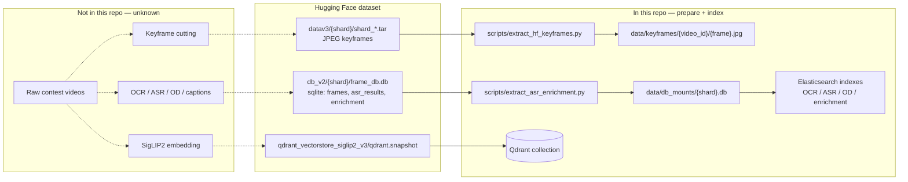

# Offline pipeline

This document describes **only what is present in the Mentos source we could read**. It does not invent missing extraction or training steps.

**Private repo checked:** `https://github.com/dinhthienan33/AIC2026-top5` — **inaccessible** from this environment (GitHub 404 / not in the token scope). No files from that repo are in this monorepo. If that repository holds the original keyframe cutter, embedder, or OCR/ASR/caption jobs, it still needs to be granted and copied under `offline/`.

What we *do* have:

- **Current (AIC 2026) runtime prepare + index scripts** in `backend/scripts/` and `backend/core/prepare_local.py` (from branch `aic2026` of `AIC2025_Mentos-v2`).
- **Historical (AIC 2025) notebook** `processing.ipynb` on the old `main` branch of that backend — FAISS / metadata merge only. It is **not** copied here (personal Windows paths, no models, notebook outputs).

---

## Current pipeline (AIC 2026) — what the code actually does

The serving stack assumes artifacts already exist on a Hugging Face dataset (default `HF_REPO_ID=htNghiaaa/aic26-lowres-keyframes`). Local scripts **download and reshape** those artifacts; they do not generate embeddings or run corpus-wide OCR/ASR from raw video.



### Inputs and outputs (from the scripts)

| Step | Script / module | Input | Output | Tools / models named in code |
|------|-----------------|-------|--------|------------------------------|
| Keyframe extract | `backend/scripts/extract_hf_keyframes.py` | HF tars under `HF_KEYFRAME_PREFIX` (default `datav3`) | `{KEYFRAME_LOCAL_DIR}/{video_id}/{frame_idx:06d}.jpg` plus `.extract_complete` | `huggingface_hub` |
| Slim sqlite | `backend/scripts/extract_asr_enrichment.py` | HF `db_v2/{shard}/frame_db.db` | `{DB_MOUNT_DIR}/{shard}.db` with `asr_results`, `enrichment` (+ FTS), thin `frames` map | Python `sqlite3` |
| FPS fill | `backend/scripts/fill_fps_from_hf.py` | Same sqlite `frames.fps` | Updates `urls.csv` `fps` column | — |
| Qdrant restore | `backend/core/snapshot.py` | HF `*.snapshot` (default `qdrant_vectorstore_siglip2_v3/qdrant.snapshot`) | Restored collection `QDRANT_COLLECTION` (default `siglip2_keyframes_final`) | Qdrant, `huggingface_hub` |
| ES OCR | `scripts/index_ocr_to_es.py` → `core/es_ocr.py` | Slim sqlite enrichment / OCR quotes | Index `ocr_keyframes` | Elasticsearch 8.15 |
| ES ASR | `scripts/index_asr_to_es.py` → `core/es_asr.py` | Slim sqlite `asr_results` | Index `asr_segments` | Elasticsearch 8.15 |
| ES OD | `scripts/index_od_to_es.py` → `core/es_od.py` | Slim sqlite enrichment entities | Index `od_entities` | Elasticsearch 8.15 |
| ES enrichment | `scripts/index_enrichment_to_es.py` → `core/es_enrichment.py` | Slim sqlite enrichment | Index `enrichment_keyframes` (used by hybrid search) | Elasticsearch 8.15 |
| Optional local GPU index | `backend/core/local_index.py` | Prebuilt `vectors_fp16.npy` + `meta.jsonl` | In-memory cosine top-k | PyTorch — **no builder script in repo** |
| Query-time encoder | `backend/core/models.py` | Text query | SigLIP2 embedding | `google/siglip2-so400m-patch14-384` |
| Contest clip ASR | `backend/core/speech_asr.py` | Uploaded audio | Transcript | `vinai/PhoWhisper-*` (default medium) |
| Contest screenshot OCR | `backend/core/screen_ocr.py` | Uploaded image | Text | Tesseract `vie+eng` |

`python run.py` calls `core/prepare_local.py`, which runs keyframe extract + slim-db extract (unless `PREPARE_LOCAL_DATA=false`), then starts local ES if needed and indexes OCR/ASR/OD/enrichment (unless `PREPARE_ELASTICSEARCH=false`).

### How to run (scripts that exist)

From `backend/` after `cp .env.example .env` and setting `HF_TOKEN` (dataset is treated as gated in the scripts):

```bash
# 1. Keyframes (~several GiB). Tars are deleted from the HF cache after extract unless --keep-tars.
python scripts/extract_hf_keyframes.py

# 2. Slim sqlite (ASR + enrichment/OCR/OD; full frame_db is not kept).
python scripts/extract_asr_enrichment.py

# 3. Elasticsearch (or let run.py do this).
bash scripts/run_elasticsearch.sh
python scripts/index_ocr_to_es.py
python scripts/index_asr_to_es.py
python scripts/index_od_to_es.py
python scripts/index_enrichment_to_es.py
# Reindex: add --reindex

# 4. Optional: copy fps from sqlite into urls.csv
python scripts/fill_fps_from_hf.py
```

Qdrant: run a local node, then start the API with `AUTO_RESTORE_SNAPSHOT=true` so `core/snapshot.py` downloads the snapshot and restores it. Image search can skip sqlite (`SKIP_DB_MOUNT=true` by default) and use `DEFAULT_FPS` (25) for timestamps.

### Unknowns (not in the accessible repos)

- How raw videos were cut into keyframes (interval, TransNet, scene detect, …). Only the resulting JPEG tars are consumed.
- How SigLIP2 vectors and the Qdrant snapshot were built. No embedding-to-Qdrant job is in `AIC2025_Mentos-v2`.
- How corpus OCR, ASR, object entities, and captions were written into `frame_db.db`. The extract script **copies** those tables; it does not run OCR/ASR/caption models over the corpus.
- How `data/local_index/vectors_fp16.npy` would be produced. `local_index.py` only loads it.
- `cams.json` for CCTV clock search: expected at `CCTV_CAMS_PATH`; the builder (`aic_tools/cctv`) is **not** in this repo.
- Anything that lives only in `AIC2026-top5`.

---

## Historical pipeline (AIC 2025 `main`) — notebook only

`processing.ipynb` on the old backend `main` branch (not copied) did **local merge work** on a Windows path `D:\3rd\AIC2025\Mentos\...`:

1. Read `media-info-aic25-b1/media-info/*.json` (notebook printed **873** files) for YouTube / thumbnail URLs.
2. Join `metadata/map-keyframes/*.csv` fps with `dataset/urls.csv` → `metadata_v2.csv`.
3. Merge FAISS `.bin` shards (notebook output: `blip2-base_0_10000_indexing.bin`, `blip2-base_10001_100001_indexing.bin`, `blip2.bin` → `blip2_indexing.bin`).
4. Merge path JSON shards (`image_path_0_10000.json`, …) — notebook output: **123,393** items in `image_path_beit3_blip2.json`.

**Unknown there too:** who extracted those keyframes, which encoder wrote the FAISS shards (filenames mention BLIP-2 / BEIT-3 / Jina; the later serving code on `main` used Jina CLIP v2), and how MongoDB Atlas ASR/OD collections were filled. `core/ocr_search.py` on `main` was a stub.

That stack (Azure Blob + FAISS + Mongo + Groq) was **replaced** on `aic2026` by Hugging Face + Qdrant + Elasticsearch + SigLIP2. Do not mix the two setups.
