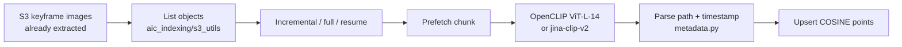
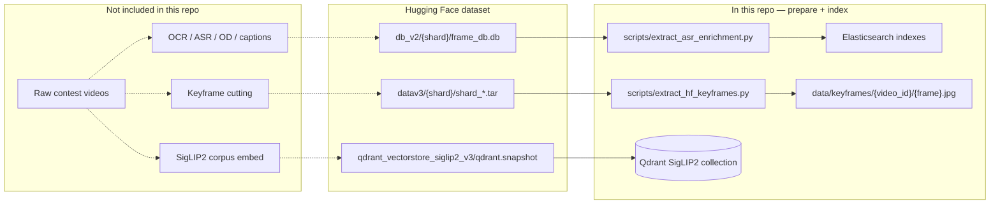

# Offline pipeline

This document describes **only code that is in this repository**. Missing stages are marked as **not included in this repo** — they are not reconstructed here.

Two separate paths exist:

1. **`offline/`** — embed already-cut keyframe images from S3 and upsert into Qdrant (OpenCLIP or Jina CLIP v2).
2. **`backend/scripts/` + `backend/core/prepare_local.py`** — download Hugging Face artifacts (JPEG tars, slim sqlite, a SigLIP2 Qdrant snapshot) and build Elasticsearch indexes for the serving API.

They are not the same job. The serving encoder is SigLIP2; the exported indexer uses OpenCLIP / Jina CLIP.

---

## What is included vs not included

| Stage | In this repo? | Where / notes |
|-------|---------------|---------------|
| Shot detection / keyframe cutting (TransNet, PySceneDetect, ffmpeg interval, …) | **Not included in this repo** | No cutter, notebook, or history in the exported trees. `offline/` assumes JPEGs already exist on S3. |
| Corpus OCR / ASR / caption / object-detection **generation** | **Not included in this repo** | No enrichment trainers or extractors. Serving copies those tables from a Hugging Face sqlite dump if present. |
| Embed keyframes → Qdrant (OpenCLIP `ViT-L-14` or `jinaai/jina-clip-v2`) | **Yes** | `offline/run_indexing.py`, `offline/aic_indexing/*` |
| Download HF JPEG tars / slim sqlite / restore SigLIP2 Qdrant snapshot | **Yes** | `backend/scripts/extract_*.py`, `backend/core/snapshot.py` |
| Index copied OCR / ASR / OD / enrichment text into Elasticsearch | **Yes** | `backend/scripts/index_*_to_es.py` |
| Query-time SigLIP2, PhoWhisper clip ASR, Tesseract screenshot OCR | **Yes (online)** | `backend/core/models.py`, `speech_asr.py`, `screen_ocr.py` — not corpus jobs |
| CCTV `cams.json` builder | **Not included in this repo** | Runtime expects `CCTV_CAMS_PATH`; no builder under `offline/` or `backend/` |

Source of the indexer: [`offline/SOURCE.txt`](../offline/SOURCE.txt) (`AIC2026-top5` `main` @ `0e2cd1c`). How to run it: [`offline/README.md`](../offline/README.md).

---

## Path A — `offline/` (S3 keyframes → embed → Qdrant)



Expected S3 key shape (regex in `offline/aic_indexing/metadata.py`):

```text
.../keyframes/<batch_folder>/keyframes/<video_id>/<numeric_frame>.<jpg|jpeg|png|webp|bmp|gif>
```

Example: `keyframes/L21_a/keyframes/L21_V001/123.jpg` → batch `L21`, timestamp `frame_index / KEYFRAME_FPS` (default 25). Non-matching keys are skipped.

### Inputs / outputs

| | |
|---|---|
| **Input** | Keyframe objects on S3; AWS credentials; Qdrant URL |
| **Output** | Qdrant collection with payload `batch_id`, `video_id`, `frame_id`, `s3_uri`, `timestamp`, `frame_index`, `model`, `embedding_dim`, `s3_etag`, `s3_last_modified` |
| **Models** | Default CLI: OpenCLIP `ViT-L-14` / `datacomp_xl_s13b_b90k` (768-d). Alternative: `jinaai/jina-clip-v2` (1024-d, optional Matryoshka truncate) |

### How to run

```bash
cd offline
python -m venv .venv && source .venv/bin/activate
pip install -r requirements.txt
# install torch for your CUDA/CPU — see offline/README.md
cp .env.example .env

python run_indexing.py --s3-uri s3://YOUR_BUCKET/YOUR_PREFIX/

# Jina CLIP v2
python run_indexing.py \
  --model-id jinaai/jina-clip-v2 \
  --model-name jinav2 \
  --qdrant-collection keyframes_jinav2_final
```

Modes: incremental (skip unchanged etag + model + dim), `--full-reindex`, `--resume-reindex`. Delete a collection with `python clear_qdrant_collection.py --yes`.

This path does **not** write Elasticsearch, FAISS dumps, or SigLIP2 vectors.

---

## Path B — serving prepare (Hugging Face artifacts → local disk + ES)

The FastAPI stack assumes artifacts already exist on a Hugging Face dataset (default `HF_REPO_ID=htNghiaaa/aic26-lowres-keyframes`). Local scripts **download and reshape**; they do not cut video or embed the corpus.



| Step | Script / module | Input | Output |
|------|-----------------|-------|--------|
| Keyframe extract | `backend/scripts/extract_hf_keyframes.py` | HF tars under `HF_KEYFRAME_PREFIX` | `{KEYFRAME_LOCAL_DIR}/{video_id}/{frame}.jpg` |
| Slim sqlite | `backend/scripts/extract_asr_enrichment.py` | HF `frame_db.db` | `{DB_MOUNT_DIR}/{shard}.db` (`asr_results`, `enrichment`) |
| FPS fill | `backend/scripts/fill_fps_from_hf.py` | sqlite `frames.fps` | Updates `urls.csv` `fps` |
| Qdrant restore | `backend/core/snapshot.py` | HF `*.snapshot` | Collection `QDRANT_COLLECTION` (default `siglip2_keyframes_final`) |
| ES OCR / ASR / OD / enrichment | `backend/scripts/index_*_to_es.py` | Slim sqlite | Elasticsearch indexes used at query time |

`python run.py` calls `core/prepare_local.py` unless `PREPARE_LOCAL_DATA=false` / `PREPARE_ELASTICSEARCH=false`.

```bash
cd backend
cp .env.example .env   # set HF_TOKEN
python scripts/extract_hf_keyframes.py
python scripts/extract_asr_enrichment.py
bash scripts/run_elasticsearch.sh
python scripts/index_ocr_to_es.py
python scripts/index_asr_to_es.py
python scripts/index_od_to_es.py
python scripts/index_enrichment_to_es.py
```

Qdrant: start a local node, then run the API with `AUTO_RESTORE_SNAPSHOT=true`.

---

## Not included in this repo (do not invent)

- How raw videos were cut into keyframes (interval, TransNet, scene detect, …).
- How the SigLIP2 Qdrant snapshot on Hugging Face was built. There is no SigLIP2 embed-to-Qdrant job in `offline/` or `backend/scripts/`.
- How corpus OCR, ASR, captions, and object entities were written into `frame_db.db`. Extract scripts **copy** those tables only.
- How `data/local_index/vectors_fp16.npy` would be produced (`backend/core/local_index.py` only loads it).
- A builder for `cams.json` (CCTV clock search).

If those jobs exist elsewhere, they were not in the exported `AIC2026-top5` offline slice or the sanitized `aic2026` backend.
