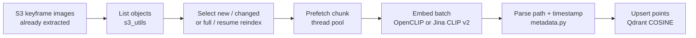

# Mentos offline pipeline (extracted)

Cleaned copy of the **offline indexing code** found in [`dinhthienan33/AIC2026-top5`](https://github.com/dinhthienan33/AIC2026-top5) (`main` @ `0e2cd1c`).

This is **not** a full offline stack. The source repo only implements **one stage**: take **already-cut keyframe images on S3**, embed them with **OpenCLIP or Jina CLIP v2**, and upsert vectors + payload into **Qdrant**.

## What is (and is not) here

| Stage | In this export? | Notes |
|---|---|---|
| Video / keyframe cutting (shot detection, ffmpeg, TransNet, PySceneDetect, …) | **No** | No such scripts, notebooks, or history on any branch. Pipeline assumes keyframes already exist on S3. |
| Embedding extraction | **Yes** | OpenCLIP (`ViT-L-14` / `datacomp_xl_s13b_b90k` by default) or Jina CLIP v2. |
| Enrichment (OCR, ASR / PhoWhisper, captioning, object detection) | **No** | Not present as processing code. Frontend stubs say OD/OCR/ASR are unavailable on the current API. |
| Index build / upload | **Yes (Qdrant only)** | Incremental / full / resume upsert. **No** Elasticsearch, **no** FAISS index writer, **no** Mongo ingest. `faiss-cpu` is only used to L2-normalize query vectors in the optional search helper. |
| SigLIP2 | **No** | Not referenced in this repo. |

`aic_indexing/dac_ta.md` in the source repo is a spec of an **older AIC2025 Mentos-v2 online backend** (FastAPI + FAISS + MongoDB + Azure + Groq). It is **not** offline processing and is **not** included.

The Streamlit search UI (`streamlit_app.py`) is **online query**, not indexing, and is **not** included.

## Pipeline overview



Expected S3 key shape (regex in `aic_indexing/metadata.py`):

```text
.../keyframes/<batch_folder>/keyframes/<video_id>/<numeric_frame>.<jpg|jpeg|png|webp|bmp|gif>
```

Example that matches: `keyframes/L21_a/keyframes/L21_V001/123.jpg`  
`L21_a` is stored as batch `L21`. Timestamp is `frame_index / KEYFRAME_FPS` (default **25**). Keys that do not match are skipped.

## Layout

```text
offline/
  README.md
  SOURCE.txt                 # source repo / branch / SHAs
  .env.example               # env names only
  requirements.txt
  run_indexing.py            # CLI entry: embed + upsert
  clear_qdrant_collection.py # CLI: delete a Qdrant collection
  aic_indexing/
    indexing.py              # pipeline orchestration
    jina_clip.py             # model load + image/text embed
    metadata.py              # path parse, point ids, timestamps
    s3_utils.py              # S3 list / download / public URL
    qdrant_search.py         # optional post-index query helper
```

## Models

| Alias / CLI | Implementation | Native dim | Weights |
|---|---|---|---|
| `ViT-L-14` (default `--model-id`) | `open_clip` | 768 | `--pretrained` default `datacomp_xl_s13b_b90k` |
| `jinaai/jina-clip-v2` | `transformers` `AutoModel` (`trust_remote_code=True`) | 1024 | Hugging Face hub id |
| Other `open_clip` arch names | `open_clip` | 768 in this wrapper | `--pretrained` |

`--model-name` is only a **payload label** stored on each Qdrant point (default `clip`). It is not the Hugging Face / OpenCLIP id.

Optional Matryoshka truncate for Jina: env `EMBEDDING_DIM` or `--embedding-dim` (`32, 64, 128, 256, 512, 768, 1024`). OpenCLIP path does not apply that truncate.

There is **no measured throughput or VRAM figure** in this repo. Do not treat CLI defaults as hardware requirements.

## Inputs / outputs

**Inputs**

- Keyframe images on S3 (see path regex above).
- AWS credentials and a reachable bucket.
- A Qdrant URL (local or cloud).

**Outputs**

- Qdrant collection (created if missing) with COSINE vectors.
- Payload fields: `batch_id`, `video_id`, `frame_id`, `s3_uri`, `timestamp`, `frame_index`, plus `model`, `embedding_dim`, `s3_etag`, `s3_last_modified`.
- Point id: existing id reused if `s3_uri` already indexed; otherwise a stable hash of `s3_uri`.

The `indexing()` return value includes empty `id2metadata` / embedding arrays. Vectors live in Qdrant, not in a local FAISS/npy dump.

## How to run

```bash
cd offline
python -m venv .venv && source .venv/bin/activate
pip install -r requirements.txt

# Torch is not pinned here. The source repo's note.txt used:
#   uv pip install 'torch==2.7.0' torchvision torchaudio \
#     --index-url https://download.pytorch.org/whl/cu126
# Use the wheel index that matches your GPU/CPU.

cp .env.example .env   # fill values
```

Index (incremental: skip unchanged etag + model + dim):

```bash
python run_indexing.py
```

Useful flags (also overridable from `.env` where noted):

```bash
python run_indexing.py \
  --s3-uri s3://YOUR_BUCKET/YOUR_PREFIX/ \
  --model-id ViT-L-14 \
  --pretrained datacomp_xl_s13b_b90k \
  --model-name clip \
  --qdrant-collection keyframes_clip \
  --fps 25 \
  --chunk-size 5000 \
  --embed-batch-size 1024 \
  --upsert-batch-size 512 \
  --s3-download-workers 48
```

Jina CLIP v2 example (from source `aic_indexing/note.txt`, bucket/prefix removed):

```bash
python run_indexing.py \
  --resume-reindex \
  --qdrant-collection keyframes_jinav2_final \
  --model-name jinav2 \
  --model-id jinaai/jina-clip-v2
```

Modes:

- default: incremental (skip if same etag / model label / dim)
- `--full-reindex`: re-embed everything; does **not** delete the collection
- `--resume-reindex`: only objects whose `s3_uri` is not yet in Qdrant

Delete a collection:

```bash
python clear_qdrant_collection.py --yes
```

## Hardware / runtime notes

- Device: CUDA if `torch.cuda` works; else CPU. Set `FORCE_CPU=1` to skip GPU.
- `jina_clip.py` enables `cudnn.benchmark` and `float32` matmul `"medium"` on CUDA.
- Image preprocess thread pool: `PREPROCESS_WORKERS` (default 16).
- CLI defaults (`embed-batch-size=1024`, `s3-download-workers=48`, `chunk-size=5000`) come from `run_indexing.py`. `indexing.py` uses a lower function default for `chunk_size` (1000) if you call it without that arg.
- **Unknown:** GPU model, VRAM, wall-clock time, image count, and whether those batch sizes were actually used in the finalist run. This repo does not record them.

## Environment variables

See `.env.example` (names only). All of these are read by the copied code:

| Name | Used by |
|---|---|
| `AWS_ACCESS_KEY_ID` | `s3_utils.create_s3_client` |
| `AWS_SECRET_ACCESS_KEY` | same |
| `AWS_REGION` | S3 client + public URL builder (code default if unset: `ap-southeast-2`) |
| `S3_URI` / `S3_BUCKET_NAME` / `S3_PREFIX` | `run_indexing.py` |
| `S3_PUBLIC_URL_TEMPLATE` | optional snapshot URL format |
| `QDRANT_URL` | indexing + collection delete (code default: `http://localhost:6333`) |
| `QDRANT_API_KEY` | same |
| `QDRANT_COLLECTION` | same (defaults differ slightly: `keyframes_clip` vs `keyframes_jinav2` on the delete script) |
| `EMBEDDING_DIM` | optional Matryoshka / stored dim |
| `KEYFRAME_FPS` | timestamp = frame_index / fps |
| `FORCE_CPU` | force CPU embedding |
| `PREPROCESS_WORKERS` | PIL/OpenCLIP preprocess threads |

No API keys, tokens, or passwords were left hardcoded in this export. Host defaults above are localhost / generic AWS region fallbacks already present in the source.

## Credits (source repo)

`git shortlog -sn --all` on the source:

| Commits | Author |
|---|---|
| 2 | dinhthienan33 (`dithienan03@gmail.com`) |
| 1 | Cursor Agent (`cursor-agent@users.noreply.github.com`) |

Almost all offline files landed in the Cursor Agent “Initial combined AIC2026 source” commit. The two later commits by **dinhthienan33** only added/wired video metadata for the **online** backend/frontend.

## Online code in the same source repo (not exported)

`AIC2026-top5` also contains a FastAPI search API and a React UI. That backend is **Qdrant + OpenCLIP/Jina + Gemini** (translate / temporal split). It is **not** the later Mentos online stack described as FastAPI + Qdrant + **SigLIP2** + **Elasticsearch** + **PhoWhisper** + **DRES proxy**. Relative to that typical later backend, this repo’s online code looks **older / narrower**, not newer.

Details: `SOURCE.txt`.
